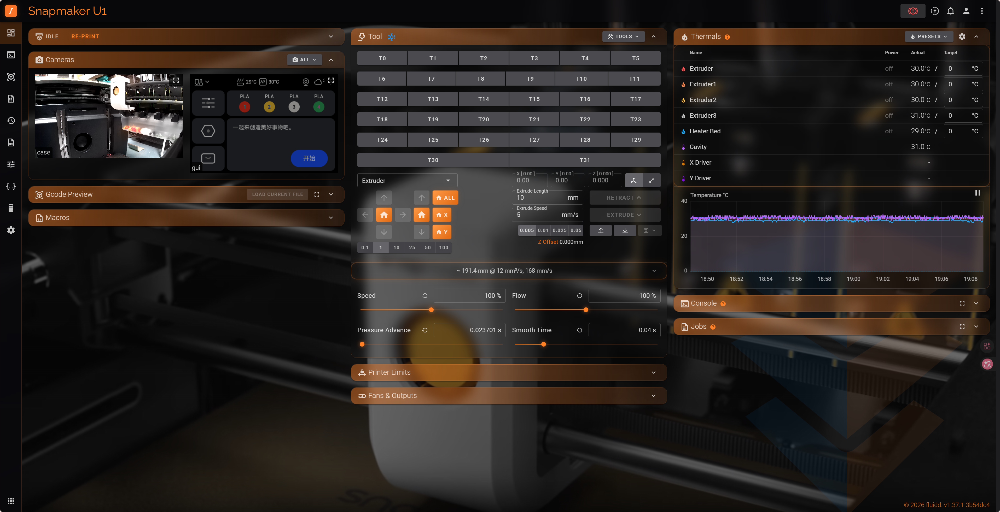
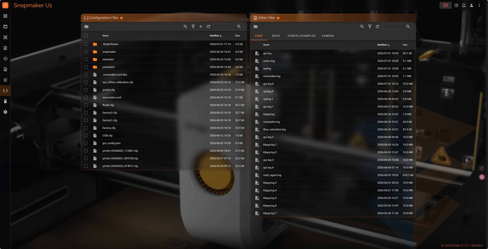

# Snapmaker-U1-Fluidd-Theme
A sci-fi glass style theme for the Snapmaker U1 Fluidd web interface.

### Installation

#### Fluidd File Manager

1. Open the U1 Fluidd UI in your browser (`http://<printer-ip>`).
2. Go to **Files** → your printer config directory (usually named `config`).
3. Create a folder named `.fluidd-theme` (note the leading dot).

5. Upload `custom.css`, `logo.png`, and `U1ToolHead.png`.

6. **Do not** enable the built-in Fluidd background image setting (the background is handled by CSS).
7. Hard-refresh the browser (`Ctrl + F5`).

### Background Image Notes

- CSS reference: `/server/files/config/.fluidd-theme/U1ToolHead.png` with `background-size: cover` for full-window fill.
- Dark overlay is about 52%; light overlay is about 20%. Adjust `linear-gradient` opacity in section 2 of `custom.css`.
- If your config directory is not named `config`, replace `/server/files/config/` in the path with your actual directory name.

### Uninstall / Restore Defaults

Delete the `.fluidd-theme` folder and refresh the browser to restore the default Fluidd appearance.

### Customizable Parameters

In the `:root`, `.theme--dark`, and `.theme--light` blocks at the top of `custom.css`:

| Variable | Purpose |
| --- | --- |
| `--u1-glass-bg` | Default card opacity in dark mode (last value of `rgba`) |
| `--u1-glass-bg` in `.theme--light` | Default card opacity in light mode |
| `--u1-glass-bg-hover` | Card opacity on hover |
| `--u1-glass-blur` | Frosted-glass blur strength |
| `--u1-yellow` | Primary orange color |

Background overlay strength: edit `0.52` (dark) / `0.2` (light) in the `linear-gradient` values in section 2 of `custom.css`.
